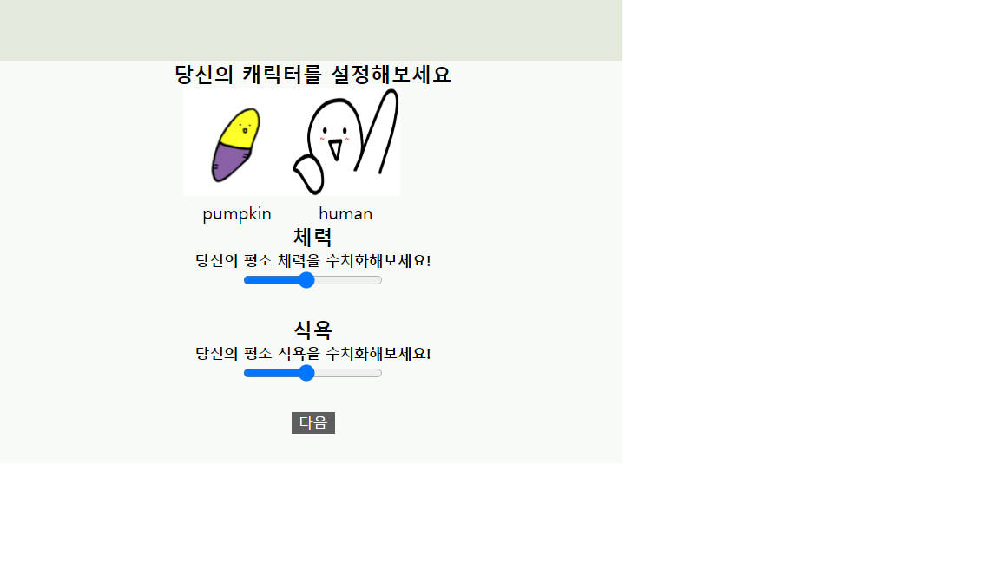

## 수정 요청 사항

### 방향이 이상함. -> flex direction바꿔줫음.     
### 캐릭터 보여주는 부분은 어디있는지??-> 이 부분은 나중에 해도 될 듯. 
## 진행사항
* 리뷰쓰기-tripList 연동완료             
* 리뷰쓰기 이미지 업로드 정상동작                  
* 캐릭터 테이블 이미지 업로드 완료.                 
* 체력, 배고픔 슬라이드 바 형태로 변경.            
          
* 캐릭터 표시해둠.       

# 결론            
### 맵에서 마커찍고 마커정보를 받아오는 부분은 아직 안됨.          
### 위 사항이 없어도 우선 영상 찍는데에는 문제 없을듯.      
### 리뷰에 대한 detail or 완료된 계획 detail 말고는 전부다 동작함.
